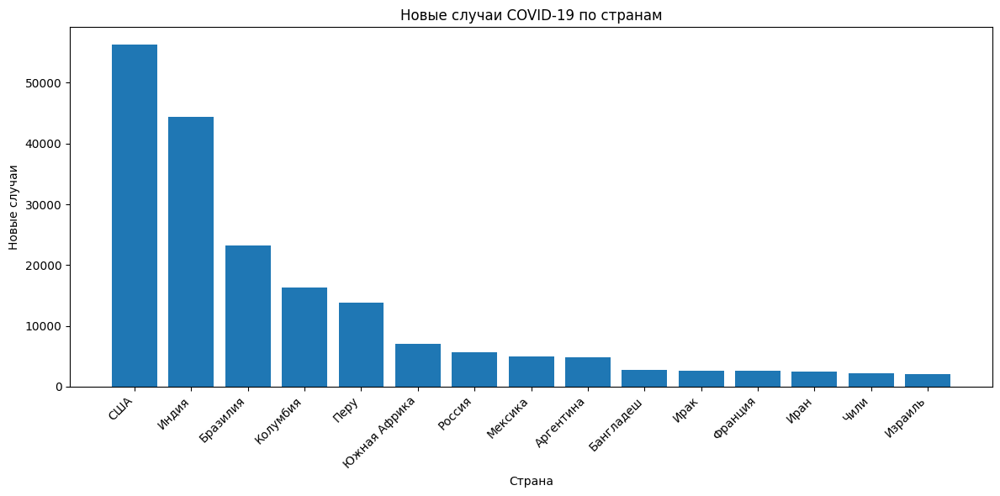
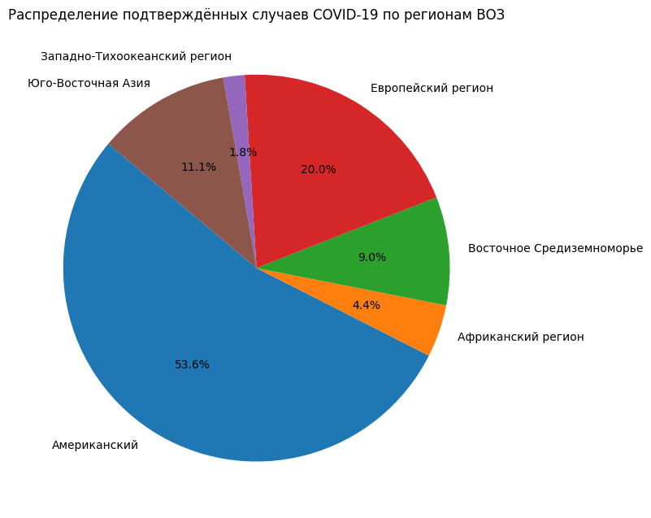

# Анализ данных COVID-19 (pandas, Python)

## Описание проекта
Данный репозиторий содержит учебный анализ данных по пандемии COVID-19, выполненный с использованием языка программирования **Python** и библиотеки **pandas**.  
Цель работы — изучить распределение подтверждённых случаев, уровни смертности и выздоровления, а также визуализировать ключевые показатели по странам и регионам ВОЗ.

Анализ выполнен в рамках учебного задания и является альтернативой выполнению тех же операций в Microsoft Excel.

---

## Используемые данные
Источник данных: CSV-файл с агрегированной статистикой COVID-19 по странам и регионам ВОЗ.

Основные поля датасета:
- `Страна/Регион`
- `Регион ВОЗ`
- `Подтверждено случаев`
- `Смертей`
- `Выздоровело`
- `Новые случаи`
- `Подтверждено за прошлую неделю`
- `Изменение за 1 неделю`
- `% прироста за 1 неделю`

---

## Этапы анализа

### 1. Предобработка данных
- Загрузка CSV-файла
- Проверка структуры данных
- Работа с кодировкой
- Проверка числовых значений и пропусков

---

### 2. Расчёт показателей
Были рассчитаны следующие показатели:

- **Процентное изменение подтверждённых случаев за неделю**
- **Уровень смертности**  
  (число смертей на 100 подтверждённых случаев)
- **Уровень выздоровления**  
  (число выздоровлений на 100 подтверждённых случаев)
- **Соотношение смертей к выздоровлениям**  
  (число смертей на 100 выздоровлений)

---

### 3. Сводные таблицы
Построены сводные таблицы для анализа:

- распределения подтверждённых случаев по регионам ВОЗ
- сравнения уровней смертности между странами

Сводные таблицы позволяют наглядно сравнивать показатели между странами и регионами.

---

### 4. Визуализация данных
В рамках анализа были построены следующие визуализации:

- **Столбчатая диаграмма новых случаев по странам**  
    

- **Круговая диаграмма распределения подтверждённых случаев по регионам ВОЗ**
    

Визуализации помогают лучше понять структуру и распределение данных.

---

## Используемые технологии
- Python 3
- pandas
- matplotlib
- Jupyter Notebook

---

## Структура репозитория
- COVID_DATASET.csv # Исходные данные
- eda.ipynb # Jupyter Notebook с анализом
- README.md # Описание проекта